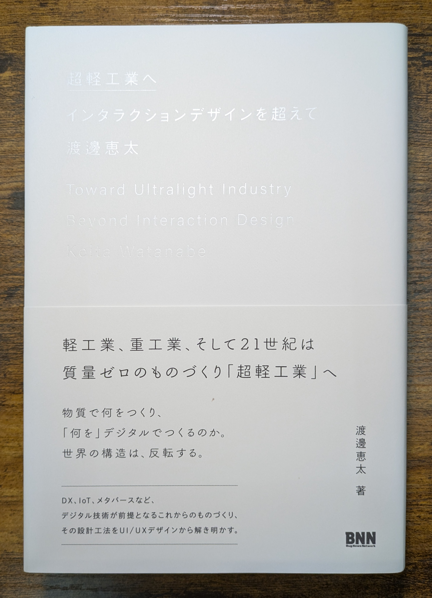

## 読書感想文

主には本屋さんでかなり目を引くビジュアルの本を見つけたので読んでみた、というお話です。

> 超軽工業へ　インタラクションデザインを超えて　（渡邊恵太　著）

{width=400px align=center}

あまりインタラクションデザインとかを知らずに買ってしまったのですが、素人でもわりとわかりやすい内容であるとは感じました。

それで、特に最近の考えとマッチする部分があったのが『平均思考は捨てなさい─出る杭を伸ばす個の科学』（トッドローズ著）という本からの引用で、**「平均的なパイロットは存在しない」**という話でした。

> （抄）
> 4,063人のパイロットから集めた大量のデータを使い、平均的な寸法を身長・胸囲など10箇所について計算した。
> そのうえで、この「平均的なパイロット」の体のサイズとの誤差が30%以内ならば、概ね平均に該当するものとみなした。
> しかし実際の数字がまとめられると、4,063人のパイロットの中で、10項目すべてが平均の範囲内に収まったケースは一つもなかったのである。

各項目が完全な独立でないとはいえ、正規分布についての理解があれば特段驚くこともないと思います。

しかしながら、これは普段意識することのない現象です。

生産において利益を最大化できる**効率性としての平均**が存在し、これからも大量生産を行う領域ではその考え方が重要であり続けるのでしょう。

しかしながら gen AI 技術の発展により、ソフトウェア領域ではこれに関してブレイクスルーが起きつつあります。

世の中にはまだまだカバーしきれていない需要が数多く残されており、ソフトウェア領域においては従来の**平均による効率性**よりも**個別最適により得られる利益**のほうが上回ってしまったというわけです。

これをハードウェア領域でも起こしていきたい、特に多品種小量生産の領域では gen AI はより効果的に活用できるはずだ、というのが私の考えであり実現したいことでもあります。

## インターン

先週今週と2週間、株式会社IHI にインターンとして受け入れてもらっていました。

あまり詳しいことは言えないのですが、受け入れ部署が修理を担当する工場でまさに「多品種少量」という感じでした。

そこでもまさに同じようなことを感じた、というお話でした。