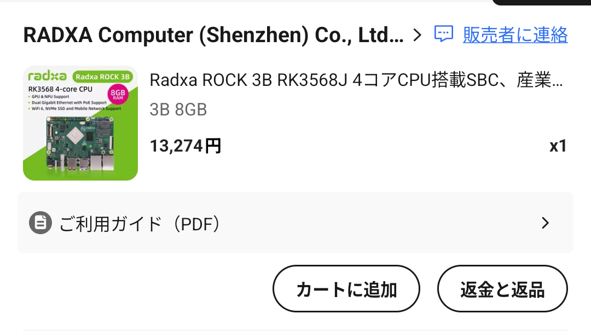

## Radxa ROCK 3B について

Radxaから出ているSBCの一つです。

CPUにはRockchip RK3568を搭載しており、4コアのCortex-A55とMali-G52 GPUを備えています。
通常のデスクトップ用途で使うには少し物足りないですが、静的なコンテンツを配信するサーバーや、軽量なCI/CD環境を構築するには十分な性能です。

なんといってもそのコスパが非常に魅力的で、私が購入したRadxaの公式ストアではRAM 8GBのモデルが13,000円程度で販売されていました。

https://a.aliexpress.com/_c4nvp3ob

(現在は在庫切れになっているみたいです)

## LinuxのARMボード対応

Radxa ROCK 3Bは、Linuxカーネルのmainlineに対応しているとかなんとかで、Radxa公式から出ている Radxa OS を使わなくても一応動きます。

ただし、初回起動時に U-Boot の設定を変更する必要があり、Radxa OS で起動する必要があります。

## 後日追記します...

